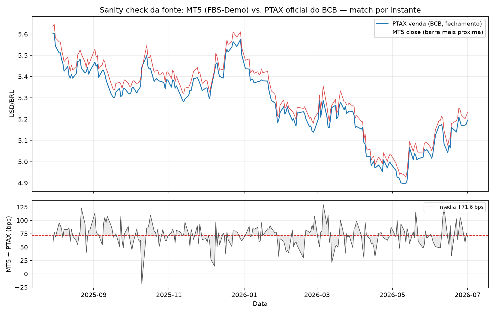
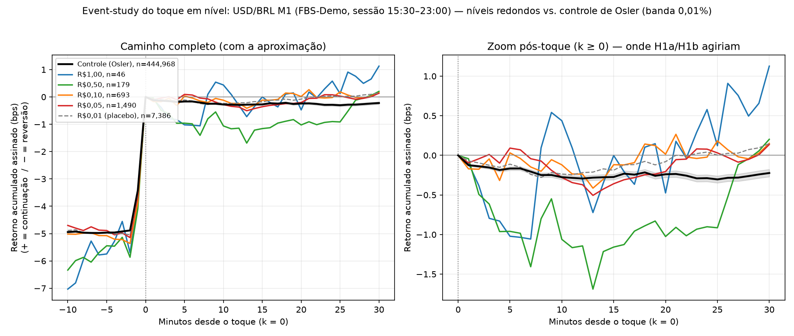

# USD/BRL Round Numbers

Replicação da metodologia de Carol Osler para o efeito de "número redondo" (suporte/resistência psicológico) em câmbio intradiário, aplicada ao par **USD/BRL** — nunca testado antes para o Real, até onde levantamos na literatura.

> **Este README documenta o desenho antes dos resultados.** Os parâmetros foram travados antes de observar qualquer resultado, para evitar p-hacking / sequential testing. Uma primeira rodada usou um proxy não-literal do controle/teste; após ler o PDF original, o desenho foi **corrigido para a fidelidade literal de Osler** e o resultado nulo se manteve (ver "Teste confirmatório" → nota de integridade). Resultados de uma fase piloto anterior (desenho diferente, descartado) existem só como motivação histórica e **não** devem ser citados como resposta final — ver "Fase piloto" abaixo.

## Hipótese

Níveis de preço "redondos" (ex.: R$5,00, R$5,50, R$5,10) funcionam como suporte/resistência psicológico em USD/BRL, gerando dois efeitos testáveis no intradiário:

- **H1a — Reversão ("bounce"):** ao tocar um nível redondo, o preço tende a recuar/reverter com mais frequência do que ao tocar um nível de controle (não redondo).
- **H1b — Aceleração:** quando o preço de fato rompe um nível redondo (não reverte), a magnitude do movimento subsequente tende a ser maior do que após romper um nível de controle.

## Metodologia (ancorada em Osler 2000)

Réplica direta de **Osler, C. (2000), "Support for Resistance: Technical Analysis and Intraday Exchange Rates", FRBNY Economic Policy Review, Vol. 6, No. 2**, adaptada para os dados disponíveis (M1 real via MT5, não order-flow proprietário).

> **Fonte dos parâmetros — confirmada contra o PDF original.** O desenho foi checado ao pé da letra contra o PDF original do NY Fed (`0007osle.pdf`, FRBNY EPR jul/2000, pp.53-68), obtido via `curl` com User-Agent de navegador depois que o fetch automatizado retornava 403. O procedimento literal (controle de 20 suportes + 20 resistências por dia, teste de sinal binomial mensal, definições de hit/bounce) está descrito abaixo exatamente como no paper, salvo as adaptações inevitáveis ao cenário brasileiro, sempre sinalizadas.

### Evento unificado (H1a/H1b em um único teste)

1. **Banda de toque:** o preço "toca" um nível redondo quando chega a **0,01%** de distância dele (percentual, escalado pelo range observado — não um valor fixo em centavos). Robustez: 0,00% e 0,02% (mesmos valores testados por Osler).
2. **Janela de classificação:** 15 minutos após o toque (horizonte primário de Osler); 30 minutos como robustez.
3. **Classificação:**
   - Se o preço **voltou** para o lado original do nível dentro da janela → **bounce** (evidência para H1a).
   - Se o preço **permaneceu do outro lado / seguiu** → **continuação** (evidência para H1b; magnitude = quanto se afastou do nível).

> **H1a é a réplica literal; H1b é extensão.** Osler (2000) testa *reversão* (bounce), mas **não** testa aceleração — no texto: *"The hypothesis that prices will trend once a trading signal is breached … is not examined here"* (p.2). Por isso H1a (bounce) é a replicação literal, enquanto **H1b (aceleração/magnitude) entra como extensão explícita**, ancorada em Curcio et al. (1997) e Brock, Lakonishok & LeBaron (1992) — os trabalhos que a própria Osler cita para "os preços se movem rapidamente uma vez rompido o nível".

### Grupo de controle / placebo

Não é offset de grid nem bootstrap de blocos dos retornos — é o **algoritmo de níveis aleatórios do próprio Osler**. Para cada dia de pregão, gera-se **20 resistências (R) + 20 suportes (S)** — o número exato do paper:

```
R_i = Abertura_dia + b_i × range_mês      b_i ~ Uniforme(0, 1)
S_i = Abertura_dia − a_i × range_mês      a_i ~ Uniforme(0, 1)     i = 1..20
```

onde `range_mês` é o maior gap absoluto entre a abertura e as máximas/mínimas intradiárias observadas naquele mês. Os níveis artificiais são **arredondados à precisão de cotação** (4 casas decimais para o USD/BRL — Osler 2000, endnote 3). Compara-se a taxa de bounce/continuação nos níveis redondos reais vs. nesses níveis artificiais.

Osler gerou **10.000 conjuntos** completos. Aqui o run primário usa **N = 5.000** (meio-termo defensável: a estatística de referência do controle é uma **média sobre os conjuntos**, que converge muito antes de 10.000). Parametrizável em `src/run_analysis.py` (`N_SETS`). A geração é feita **por dia, sob demanda** dentro do scan de eventos (`src/events.py`), para não materializar os ~45 milhões de níveis (5.000 × 224 dias × 40) em memória.

### Sessão de negociação (equivalente BR ao recorte 9h–16h NY)

Osler restringe a amostra a 9h–16h NY para excluir o overnight ilíquido do feed 24h da EBS. Aqui a fonte já é um símbolo **onshore** `USDBRL` (FBS-Demo) que **só cota durante o pregão brasileiro**: não existe barra fora de ~14h–23h no timestamp do servidor. O filtro `filter_session` mantém a janela consistente **[15:30, 23:00)** (uniformiza os dias que abrem 15:30 e descarta as poucas barras esparsas de abertura antecipada) — ou seja, a restrição de sessão já vem embutida na fonte, e o filtro só a torna uniforme. O offset exato servidor→horário de Brasília não é confirmável sem documentação do broker (FBS ≈ UTC+2/+3), então a janela é reportada pelo timestamp dos dados.

### Granularidade dos níveis redondos

Hierarquia por força decrescente: **R$1,00 / R$0,50 / R$0,10 / R$0,05**, com **R$0,01 como placebo de falsificação** (nível "redondo" fraco demais para ter efeito psicológico esperado — serve de checagem negativa). Definida por análise de poder estatístico real sobre os dados MT5 durante a fase piloto.

### Teste confirmatório

Dois testes complementares, cada grade contra a mesma nula de controle.

**(1) PRIMÁRIO — sinal binomial mensal (o teste literal de Osler 2000).** Osler *não* usa percentil de Monte Carlo. O procedimento dela (pp.61-62):

1. Para cada mês, calcula a bounce frequency dos níveis reais → `BP_mês`.
2. Para cada mês, calcula a bounce frequency de cada um dos N conjuntos de controle e tira a **média sobre os conjuntos** → `BA_mês`.
3. Conta em quantos dos `N_meses` vale `BP_mês > BA_mês`.
4. **Teste de sinal binomial:** essa contagem vs. `Binomial(N_meses, 0,5)`; a significância é a cauda superior.

onde `bounce frequency = bounces / total de hits`. A mesma lógica de sinal mensal é aplicada a H1b, trocando a bounce frequency pela magnitude média de continuação (`MP_mês` vs `MA_mês`). Teste **unilateral** (as hipóteses são direcionais).

**(2) COMPLEMENTAR — p-valor empírico Monte Carlo `(r+1)/(N+1)`.** Com apenas ~13 meses de amostra, o sinal binomial é **pouco potente** (precisa de ~10-11 dos 13 meses para p < 0,05). Como checagem mais potente, reportamos em paralelo o p-valor empírico de North, Curtis & Sham (2002): a estatística *agregada* (pooled sobre todos os meses) dos níveis redondos vs. a distribuição dessa mesma estatística sobre os N conjuntos de controle, com `r = #{T_k ≥ T_obs}`.

Cada grade real (R$1,00 / R$0,50 / R$0,10 / R$0,05) é testada; reporta-se o p por grade e, em paralelo, a correção **Bonferroni** sobre as 4 grades (conservadora — grades aninhadas/correlatas). A grade **R$0,01 é placebo de falsificação**: espera-se que *não* seja significativa; se for, é sinal de **artefato**, não de ancoragem real.

`N = 5.000` conjuntos de controle no run primário. Parametrizável em `src/run_analysis.py` (`N_SETS`, `SEED`).

> **Nota de integridade — correção metodológica.** Uma primeira rodada usou um *proxy* não-literal (controle de 1 R + 1 S por dia, N = 2.000, e p-valor de Monte Carlo como teste primário). Após obter e ler o **PDF original**, o desenho foi corrigido para a fidelidade literal descrita acima (controle 20+20/dia, teste de sinal binomial mensal). **O resultado nulo de H1a se manteve** entre o proxy e a versão literal — o que reforça a robustez da conclusão. Esta versão literal é a definitiva.

## Dados

- **Fonte primária:** MetaTrader5, símbolo `USDBRL`, conta demo **FBS-Demo**, M1 real (não agregado), ~336 dias corridos (2025-07-30 até hoje), 224 dias distintos de pregão.
- **Robustez out-of-sample:** conta demo **Tickmill-Demo** (corretora diferente, mesmo desenho).
- **Sessão:** símbolo *onshore* que só cota o pregão brasileiro; a análise usa a janela consistente **[15:30, 23:00)** do timestamp do servidor (98.694 barras). Ver "Sessão de negociação" acima.
- **PTAX diário (BCB):** taxa oficial de referência do Banco Central, usada apenas como checagem de sanidade da fonte (ver abaixo), não como fonte intradiária.
- Ver detalhes completos de todas as fontes avaliadas e descartadas (HistData, Dukascopy, TradingView, Bloomberg) na documentação interna do projeto.

### Sanity check da fonte (MT5 vs. PTAX oficial)

Para confirmar que o feed de corretora demo é um proxy legítimo do USD/BRL à vista, casamos o `close` M1 do MT5 com a **PTAX de venda de fechamento** do BCB (API Olinda) **no mesmo instante** — a PTAX é apurada ~13h de Brasília (≈16h UTC), que cai dentro da nossa sessão. Match *nearest* com tolerância de 5 min, 223 dias casados. Roda com `python -m src.sanity_ptax`.



- **Fonte validada:** correlação de nível **0,998** — o feed reproduz cada oscilação da taxa oficial, **sem erro de escala, unidade ou inversão**.
- **Achado — prêmio de nível:** o feed demo fica **~+72 bps (≈0,7%) acima** da PTAX de forma estável (mediana +71,8 bps, desvio 20 bps, **sem deriva secular** ao longo do ano), comportamento típico de cotação sintética de conta demo (markup de corretora).
- **Limitação decorrente:** os níveis testados são "redondos" *no preço do feed*; o offset de ~0,7% os desloca frente aos redondos do mercado real. Isso é **desprezível para a grade grossa** (R$1,00 ≈ 18% de espaçamento) mas uma fração não-trivial das grades finas (R$0,05 ≈ 0,9%; R$0,01 ≈ 0,18%). Ou seja, **o nulo da grade R$1,00 é o mais confiável**, e o achado reforça o caveat de "cotação demo, não order flow". Não altera a conclusão nula — apenas enfraquece o poder de detectar um eventual efeito real nas grades finas.

### Reprodutibilidade

O snapshot usado na análise (`data/raw/usdbrl_m1_fbs_demo.csv`) é **versionado diretamente no repositório** (não fica em `.gitignore`), justamente para que qualquer pessoa consiga reproduzir a análise sem precisar de uma conta demo MT5 própria. Para gerar um snapshot novo/atualizado, use `src/ingest_mt5.py` com o terminal MT5 aberto e logado. O snapshot da PTAX (`data/raw/ptax_bcb_fechamento.csv`) também é versionado, para que o sanity check rode offline.

## Resultado confirmatório

**Resultado nulo: não há evidência do efeito de número redondo de Osler para o USD/BRL neste conjunto de dados** (13 meses de M1, FBS-Demo, sessão [15:30, 23:00), ~98,7 mil barras). Rodado com `N = 5.000` conjuntos de controle sob o desenho literal. Tabela completa (primário + 3 variantes de robustez) em [`results/confirmatory_results.csv`](results/confirmatory_results.csv); reproduzível com `python -m src.run_analysis`.

Desenho primário (banda 0,01%, janela 15 min). `p_binomial` = teste literal de sinal mensal; `p_MC` = Monte Carlo complementar:

| Grade | Hipótese | Meses (BP>BA) | Est. obs. | Nula (média) | p_binomial | p_MC |
|-------|----------|:-------------:|----------:|-------------:|-----------:|-----:|
| R$1,00 | H1a bounce | 0/2 | 0,447 | 0,550 | 1,000 | 1,000 |
| R$0,50 | H1a bounce | 3/6 | 0,546 | 0,550 | 0,656 | 0,814 |
| R$0,10 | H1a bounce | 4/12 | 0,519 | 0,550 | 0,927 | 1,000 |
| R$0,05 | H1a bounce | 8/13 | 0,551 | 0,550 | 0,291 | 0,347 |
| R$1,00 | H1b magnitude | 1/2 | 0,0039 | 0,0046 | 0,750 | 1,000 |
| R$0,50 | H1b magnitude | 4/6 | 0,0047 | 0,0046 | 0,344 | 0,058 |
| R$0,10 | H1b magnitude | 7/12 | 0,0048 | 0,0046 | 0,387 | **0,001** |
| R$0,05 | H1b magnitude | 5/13 | 0,0047 | 0,0046 | 0,867 | **0,004** |
| **R$0,01 (placebo)** | H1a bounce | 6/13 | 0,546 | 0,550 | 0,709 | 0,827 |
| **R$0,01 (placebo)** | H1b magnitude | 6/13 | 0,0047 | 0,0046 | 0,709 | **0,025** |

Leitura:

- **H1a (reversão) — nulo, os dois testes concordam.** A taxa de bounce nos níveis redondos não supera a de níveis arbitrários: fica igual ou um pouco *abaixo* da média nula (~0,55, valor próximo do ~56% que a própria Osler reporta). Nenhum `p_binomial` nem `p_MC` < 0,05, em nenhuma grade.
- **H1b (aceleração) — nulo pelo teste literal; o "sinal" do Monte Carlo é artefato.** O sinal binomial mensal não acusa nada (todos `p_binomial` ≥ 0,34). O Monte Carlo *pooled* marca algumas grades como significativas (0,10 → 0,001; 0,05 → 0,004) — **mas marca também o placebo R$0,01 (0,025)**, que por construção não deveria ter efeito psicológico. Como o placebo mostra o mesmo padrão, isso é um **artefato de agregação**, não ancoragem: os níveis redondos (e o placebo, que ladrilha quase todo o eixo de preço) sentam exatamente sobre o caminho do preço, enquanto os controles ficam espalhados pelo range mensal — o que enviesa a comparação *pooled* de magnitude. O teste de sinal mensal, que compara mês a mês contra `BA_mês`, não cai nesse viés, e o placebo o denuncia. **Não há evidência crível de aceleração.**
- **Robustez:** o nulo de H1a se mantém nas variantes de banda (0,00% / 0,02%) e janela (30 min). O padrão de H1b (literal nulo, MC positivo inclusive no placebo) também se repete, confirmando o diagnóstico de artefato.

**Limitação central — baixa potência.** Com apenas 13 meses, `Binomial(13, 0,5)` exige ~10-11 meses com `BP>BA` para p < 0,05; grades grossas (R$1,00) têm ainda menos meses com hits (só 2). O nulo é, portanto, um nulo **sob baixa potência**: ausência de evidência, não evidência forte de ausência. Outras limitações: cotação de corretora demo (não order flow), e a assimetria natural entre o número de eventos de uma grade real e de um conjunto de controle (herdada do desenho de Osler). Ainda assim, a convergência dos dois testes para H1a e o diagnóstico de artefato para H1b tornam a conclusão robusta dentro da amostra disponível.

Isso é consistente com o resultado nulo da fase piloto (desenho pré-Osler, ver abaixo): o mecanismo documentado por Osler para pares de mercados desenvolvidos **não se replica** de forma detectável para o Real neste período.

### Corroboração visual — event-study do toque

Além do teste confirmatório, um *event-study* alinha cada toque de nível em `k = 0` e acompanha o **retorno acumulado assinado** (em bps) de −10 a +30 minutos. O sinal segue a direção de aproximação (`+1` se veio de baixo, `−1` se veio de cima), de modo que no eixo y **positivo = continuação** e **negativo = reversão/bounce**. Se H1a fosse verdadeira, a curva dos níveis redondos ficaria *abaixo* da curva de controle no trecho pós-toque.



Os dois painéis (caminho completo + zoom pós-toque) mostram o nulo de forma direta: pós-toque, os retornos assinados ficam próximos de zero e as curvas dos níveis redondos **coincidem com a banda de controle** de Osler — nenhum sinal de reversão sistemática. O gráfico é leitura visual do resultado, não substitui o teste (a viz usa `N = 25` conjuntos de controle *pooled*, suficiente para uma média suave; o teste confirmatório usa `N = 5.000`). Reproduzível com `python -m src.event_study`; a tabela `média ± SE` por passo e grupo fica em [`results/event_study_paths.csv`](results/event_study_paths.csv) (reaproveitável no dashboard).

## Estrutura do repositório

```
data/
  raw/               snapshots brutos M1 puxados do MT5 (versionados)
  processed/         dados intermediários derivados (não versionados, regeneráveis)
src/
  ingest_mt5.py      ingestão do histórico M1 via MetaTrader5
  round_levels.py    geração da grade de níveis redondos nominais
  control_levels.py  gerador de níveis de controle (20 R + 20 S por dia, Osler 2000)
  events.py          filtro de sessão + toque + classificação + scan mensal de controle
  stats.py           teste de sinal binomial mensal (literal) + Monte Carlo (complementar)
  run_analysis.py    driver ponta a ponta (primário + robustez)
  event_study.py     event-study assinado do toque (redondo vs. controle) → figura + CSV
  sanity_ptax.py     sanity check da fonte: MT5 vs. PTAX oficial do BCB (match por instante)
dashboard/
  app.py             dashboard interativo (Streamlit) — camada de comunicação leiga
results/             tabelas de saída do teste confirmatório (versionadas)
figures/             figuras de research (event-study, sanity check)
notebooks/           exploração e validação ad-hoc
```

## Entregáveis

1. **Paper/análise** com o desenho pré-registrado acima (rigor estatístico: testes, p-valores, robustez).
2. **Dashboard interativo (Streamlit)** — a *camada de comunicação*, pensada para um público leigo entender a história sozinho, sem jargão. Reaproveita os mesmos módulos de `src/` e os CSVs de resultado. Cinco telas: a crença popular → explorar o preço e os toques → o teste explicado como "redondo vs. número sorteado" → o que o dólar faz depois de encostar → o veredito (com as ressalvas). O conteúdo técnico-estatístico fica de propósito no paper, não no dashboard.

```bash
pip install -r requirements.txt
streamlit run dashboard/app.py    # a partir da raiz do repositório
```

## Fase piloto (histórico, não confirmatório)

Antes de travar o desenho acima, uma fase exploratória sobre os dados FBS-Demo (~99.823 barras M1) gerou aprendizados que levaram às decisões atuais, mas cujos números **não valem como teste confirmatório** (sequência de testes / risco de p-hacking):

- Descoberta e correção de um bug de gap de fim de semana que inflava a contagem de eventos em ~11-12%.
- Teste binário de bounce (bootstrap simples) e regressão de magnitude com erros-padrão Newey-West, ambos sobre um desenho de grid + offset arbitrário (pré-Osler) — resultado nulo (nenhum p-valor < 0,05) em 8 combinações grid × horizonte.

Esses resultados ficam documentados apenas como motivação para o desenho atual, não como resposta do projeto.

## Referências

- Osler, C. (2000). "Support for Resistance: Technical Analysis and Intraday Exchange Rates." *FRBNY Economic Policy Review*, 6(2).
- Osler, C. (2003). "Currency Orders and Exchange Rate Dynamics: An Explanation for the Predictive Success of Technical Analysis." *Journal of Finance*, 58(5).
- Alexander, S. (1961). "Price Movements in Speculative Markets: Trends or Random Walks?" *Industrial Management Review*.
- Brock, W., Lakonishok, J., & LeBaron, B. (1992). "Simple Technical Trading Rules and the Stochastic Properties of Stock Returns." *Journal of Finance*, 47(5).
- Curcio, R., Goodhart, C., Guillaume, D., & Payne, R. (1997). "Do Technical Trading Rules Generate Profits? Conclusions from the Intra-day Foreign Exchange Market." *LSE Financial Markets Group Discussion Paper* (âncora do H1b — aceleração após rompimento).
- North, B. V., Curtis, D., & Sham, P. C. (2002). "A Note on the Calculation of Empirical P Values from Monte Carlo Procedures." *American Journal of Human Genetics*, 71(2), 439–441.
- Davison, A. C., & Hinkley, D. V. (1997). *Bootstrap Methods and Their Application.* Cambridge University Press.
